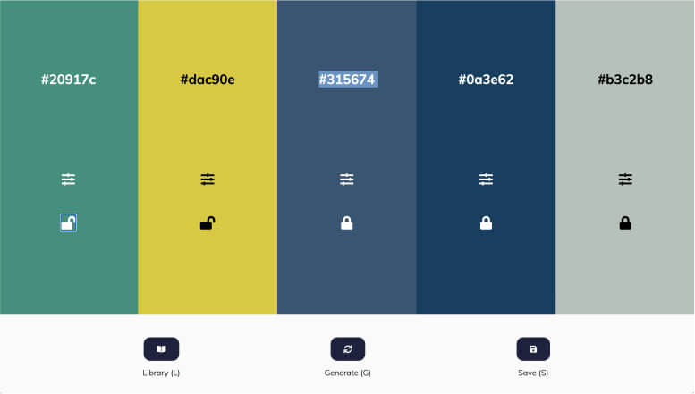

# Palette-Pro

## Table of contents

- [Overview](#overview)
- [Project Links](#links)
- [Development](#development)
- [What I Learned](#what-i-learned)
- [Issues](#issues)
- [To Do](#to-do)
- [Acknowledgments](#acknowledgments)
- [Author](#etienne-desfontaines)

## Overview

A web-based tool for designers and creatives to easily create color palettes. It allows users to randomly generate colors and to edit, save, and recall the results.

### My Roles:

- Developer

### Links

- [Live site](https://palette-pro.netlify.app/)

## Development

This project was built as an educational exercise.

### Technologies Used:

- HTML5
- CSS3
- JavaScript

### My process

#### HTML

I initiated this project by creating the complete HTML document.

#### CSS

Once the HTML was complete I styled a static version of the site.

#### JavaScript

The core focus of the website was its functionality, which required extensive work in JavaScript. As a result, a significant portion of my time was dedicated to JavaScript development.

## What I learned

### JavaScript

- Utilising JavaScript libraries
- Local Storage: Saving and getting data from local storage.
- Random Number Generation

#### Chroma js

I learnt the basics of Chroma JS, a JavaScript library for randomly generating and manipulating colours in various ways.

### JSON

I gained valuable experience in working with JSON data and its manipulation to meet various requirements. I learned how to parse JSON data, extract specific information, and modify it to suit different contexts. Additionally, I explored techniques to convert JSON data into other formats, such as transforming it into arrays or objects as necessary.

## Issues

- Users cannot currently choose to have colours displayed in a format other than HEX Code.
- Popup windows do not have event listeners to allow them to be easily closed using esc.
- users cannot change the arrangement of the colour swabs.

## To Do

- Add colour blindness checker
- Add colour contrast checker

## Acknowledgments

Thank you to Chroma JS for the great colour manipulation library.

## Etienne Desfontaines

- [Website](https://etiennedesfontaines.com/)
- [Linkedin](https://www.linkedin.com/in/etienne-desfontaines-818349284/)
- [Frontend Mentor](https://www.frontendmentor.io/profile/etiennedesfontaines)
- [Exercism](https://exercism.io/profiles/etiennedesfontaines)
